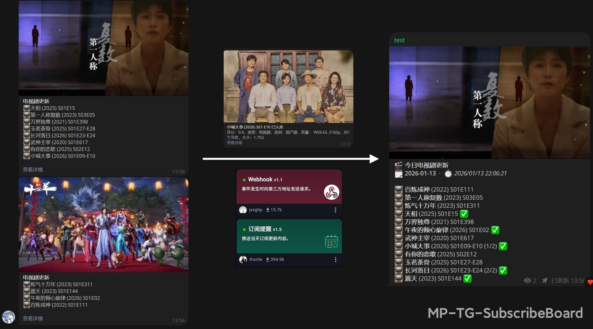
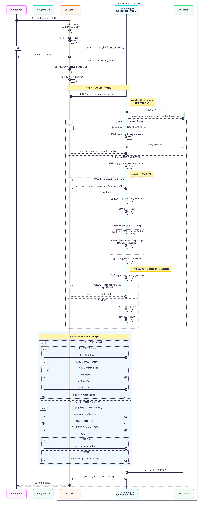
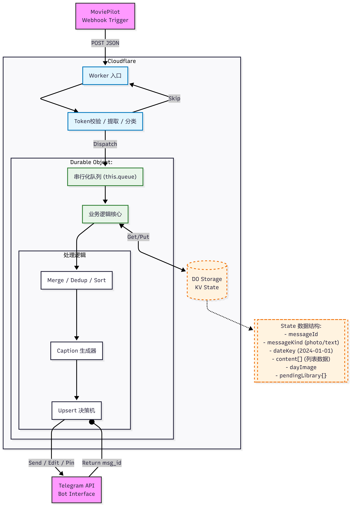
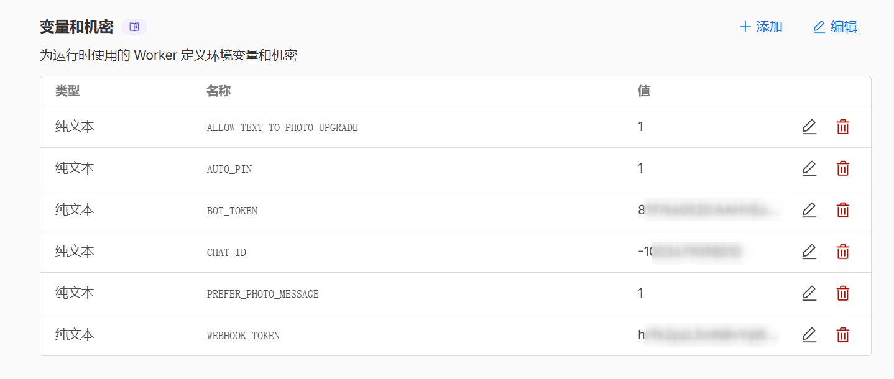
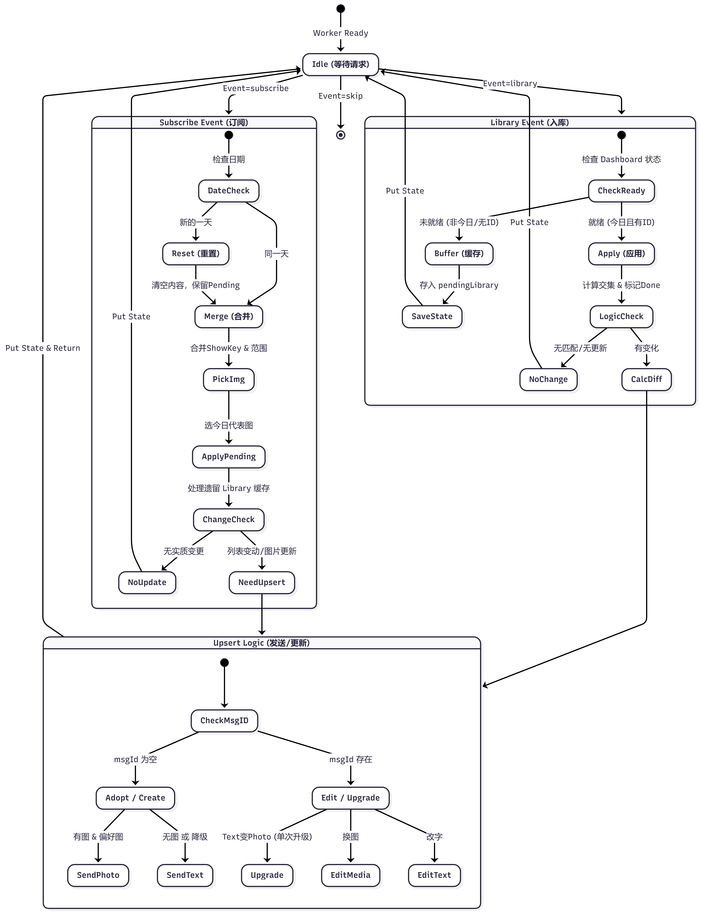
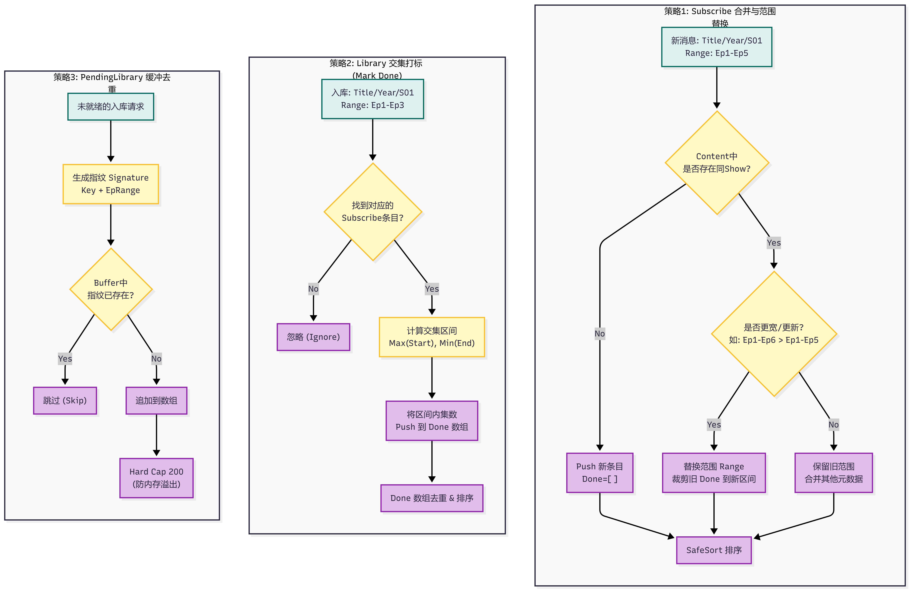

# MP-TG-SubscribeBoard

> 将 MoviePilot 的订阅提醒聚合为 Telegram 中一条可持续编辑的置顶消息：  
> 📌 「今日电视剧更新」看板（只编辑、不刷屏）

**MP-TG-SubscribeBoard** 是一个基于 Cloudflare Workers + Durable Object 的轻量级聚合服务，用于接收 MoviePilot「订阅提醒（电视剧更新）」Webhook 并将其聚合成 Telegram 的单条消息。

## 效果预览

https://github.com/user-attachments/assets/2fb438f4-e3e7-4fdb-b940-b5eca3f30160

> 如果视频无法显示，请查看：[preview-board.mp4](docs/images/preview-board.mp4)

---

## 目录

1. [项目背景](#1️⃣-项目背景)
2. [核心功能](#2️⃣-核心功能)
3. [工作流程](#3️⃣-工作流程)
4. [系统架构与组件](#4️⃣-系统架构与组件)
5. [配置与部署](#5️⃣-配置与部署)
6. [Webhook 与事件类型](#6️⃣-webhook-与事件类型)
7. [行为细节与去重策略](#7️⃣-行为细节与去重策略)
8. [使用示例](#8️⃣-使用示例)
9. [项目结构](#9️⃣-项目结构)
10. [常见问题](#🔟-常见问题)
11. [License](#📄-license)

---

## 1️⃣ 项目背景

在 MoviePilot 中，你可以使用「订阅提醒」插件获取电视剧、动画、国漫等更新通知。但是存在几个问题：

- 一天的更新可能分页多条消息（每页最多 8 条），导致频道杂乱。
- 每天的通知重复发送或多个 Webhook 并发触发时，会发送多条消息。
- 用户希望每日只置顶一条「今日更新」消息，长期可持续编辑，而不是刷屏。

**MP-TG-SubscribeBoard** 旨在解决以上问题，将订阅提醒聚合、去重，并发送到 Telegram 中的一条固定消息，实现：

- ✅ 每日只有一条置顶消息
- ✅ 多分页提醒自动合并
- ✅ 消息可持续编辑更新
- ✅ 完全静默地忽略非订阅提醒内容

---

## 2️⃣ 核心功能

### 严格筛选订阅提醒

- 只处理包含关键字「电视剧更新」的消息
- 只处理以 📺︎ 开头的剧集行
- 信任 MoviePilot 插件的集数格式，不拆分 / 合并集数

### 支持"已入库"通知并标记进度

- 识别「已入库」消息并标记对应剧集
- 在看板中显示 ✅ 与进度（例如 `E01-E04 (2/4) ✅`）
- 入库通知不会触发新一天的看板，只做补充

### 聚合分页消息

- 当日多条订阅提醒（分页）自动合并
- 不会重复发送多条消息

### 单条 Telegram 消息置顶编辑

- 首次发送 → 新建消息
- 后续更新 → 编辑同一条消息
- 消息内容每天自动刷新

### 每日代表图

- 第一次收到订阅提醒 → 采用首个有效图片链接
- 当日内后续分页 → 保持同一张图片
- 第二天重新选择

### 防并发、锁机制

- 使用 Durable Object 串行化处理
- 避免多个 Webhook 同时触发重复发送

### Webhook Token 身份验证

- URL 参数 `?token=xxx`
- 防止未经授权访问

---

## 3️⃣ 工作流程

**一句话版本**：MoviePilot 触发 Webhook → Worker 校验/解析 → Durable Object 聚合 → Telegram 发送或编辑同一条消息。





```
MoviePilot SubscribeReminder → Cloudflare Worker → Durable Object 聚合 → Telegram 消息
```

1. **MoviePilot 订阅提醒插件触发 Webhook**
2. **Worker 校验 Token 和内容**
3. **聚合当日所有「电视剧更新」**
4. **Telegram**：
   - 首次 → 发送新消息
   - 后续 → 编辑同一条消息

非订阅提醒消息完全忽略，保持频道干净。

---

## 4️⃣ 系统架构与组件



### Cloudflare Workers

- 无服务器、低成本、全天候可用
- 负责接收 Webhook、校验身份、解析请求体

### Cloudflare Durable Object

- 存储每日聚合状态（消息 ID、当天标题、图片 URL、剧集列表、入库状态）
- 串行化更新防止并发重复发送

### Telegram Bot API

- 发送 / 编辑消息
- HTML parse_mode 支持

### 安全措施

- Webhook Token
- 严格筛选剧集行

---

## 5️⃣ 配置与部署

### 快速部署（推荐新手）

通过 GitHub 集成实现一键部署和自动更新。

#### 第一步：Fork 项目

1. Fork 本项目到你的 GitHub 账号
2. 可以设为 Private 私密仓库（只要 Cloudflare GitHub App 有权限访问即可）

#### 第二步：连接 Cloudflare

1. 进入 [Cloudflare Dashboard](https://dash.cloudflare.com/) → **Workers & Pages** → **Create application**
2. 选择 **Continue with GitHub** / 连接 GitHub
3. 安装/授权 "Cloudflare Workers and Pages" GitHub App
   - 建议选择 **"Only select repositories"**，只勾选你 fork 的仓库
4. 选定你的 repo + 分支（通常是 `main`），完成首次部署
5. 之后每次 push 代码都会自动触发部署 🎉

#### 第三步：配置环境变量

部署完成后，进入 **Worker → Settings → Variables and Secrets** 页面，按需添加以下配置：



**必填项（缺失会导致 401 或运行错误）：**
- `WEBHOOK_TOKEN` ← 点击 **Add variable** → 选择 **Encrypt** (机密)
- `BOT_TOKEN` ← 点击 **Add variable** → 选择 **Encrypt** (机密)
- `CHAT_ID` ← 点击 **Add variable** → 可选择 **Text** (明文变量) 或 **Encrypt** (机密)

**选填项（不填也能运行，有默认值）：**
- `TIME_ZONE` (默认 `Asia/Shanghai`)
- `STRICT_SINGLE_MESSAGE` (默认 `1`)
- `ADOPT_PINNED` (默认 `1`)
- `AUTO_PIN` (默认 `0`)
- `PREFER_PHOTO_MESSAGE` (默认 `1`)
- `ALLOW_TEXT_TO_PHOTO_UPGRADE` (默认 `1`)

配置完成后点击 **Save and Deploy** 即可生效！详细配置说明请参考 [环境变量与机密配置表](#环境变量与机密配置表)。

---

### 本地开发与部署（进阶）

适合需要本地调试或自定义部署流程的开发者。

#### 前置条件

- Node.js（推荐 LTS）
- Cloudflare 账号（启用 Workers + Durable Objects）
- Telegram Bot（通过 @BotFather 创建）

#### 安装依赖

需要安装 Wrangler：
```bash
npm install -g wrangler
```

#### 本地运行
```bash
wrangler dev --local
```

默认监听 `http://localhost:8787`，用于调试 Webhook 请求。

#### 部署到 Cloudflare

登录并部署：
```bash
wrangler login
wrangler deploy
```

配置 Secrets：
```bash
wrangler secret put WEBHOOK_TOKEN
wrangler secret put BOT_TOKEN
wrangler secret put CHAT_ID
wrangler deploy
```

---

### 环境变量与机密配置表

以下是完整的配置项说明，可通过 Cloudflare Dashboard 的 **Variables and Secrets** 页面或 `wrangler secret put` 命令设置。

#### 必填配置（缺失会导致 401 或运行错误）

| 名称 | 建议类型<br>(Dashboard 里) | 作用 | 触发条件 |
|------|---------------------------|------|----------|
| `WEBHOOK_TOKEN` | 机密 (Encrypt) | Webhook 鉴权：URL `?token=` 必须等于它，否则返回 401 | 所有请求都会先校验 |
| `BOT_TOKEN` | 机密 (Encrypt) | Telegram Bot Token，用于发送/编辑消息 | 进入有效更新分支时会检查缺失并报错 |
| `CHAT_ID` | 变量 (Text)<br>*(想隐藏也可选 Encrypt)* | Telegram 频道/群组 ID；同时用于 Durable Object 分片路由<br>`idFromName(String(env.CHAT_ID))` | 进入有效更新分支时会检查 + 用于 DO 路由 |

#### 选填配置（不填也能运行，代码中有默认值）

| 名称 | 默认值 | 作用 | 代码依据 |
|------|--------|------|----------|
| `TIME_ZONE` | `Asia/Shanghai` | 生成日期 key、更新时间的时区 | `env.TIME_ZONE` |
| `STRICT_SINGLE_MESSAGE` | `1` | 严格模式：确保每日只有一条看板消息 | `env.STRICT_SINGLE_MESSAGE` |
| `ADOPT_PINNED` | `1` | 尝试"接管置顶消息"作为看板（避免创建新消息） | `env.ADOPT_PINNED` |
| `AUTO_PIN` | `0` | 是否自动置顶/取消置顶看板消息 | `env.AUTO_PIN` |
| `PREFER_PHOTO_MESSAGE` | `1` | 优先使用"照片消息"（带 caption）作为看板 | `env.PREFER_PHOTO_MESSAGE` |
| `ALLOW_TEXT_TO_PHOTO_UPGRADE` | `1` | 允许将"文本看板"一次性升级为"照片看板" | `env.ALLOW_TEXT_TO_PHOTO_UPGRADE` |

#### 通过 Wrangler CLI 配置示例
```bash
# 必填机密
wrangler secret put WEBHOOK_TOKEN
wrangler secret put BOT_TOKEN
wrangler secret put CHAT_ID

# 选填变量（也可在 wrangler.toml 中配置）
wrangler secret put TIME_ZONE
# 输入：Asia/Shanghai
```

#### 通过 wrangler.toml 配置示例
```toml
name = "mp-tg-subscribeboard"
main = "work.js"

[vars]
CHAT_ID = "-1001234567890"  # 也可通过 Secret 设置
TIME_ZONE = "Asia/Shanghai"
STRICT_SINGLE_MESSAGE = "1"
ADOPT_PINNED = "1"
AUTO_PIN = "0"
PREFER_PHOTO_MESSAGE = "1"
ALLOW_TEXT_TO_PHOTO_UPGRADE = "1"

[[durable_objects.bindings]]
name = "BOARD_AGGREGATOR"
class_name = "BoardAggregator"

[[migrations]]
tag = "v1"
new_classes = ["BoardAggregator"]
```

> **注意**：机密 (Secret) 类型的变量（如 `WEBHOOK_TOKEN`、`BOT_TOKEN`）不能写在 `wrangler.toml` 中，必须通过 `wrangler secret put` 或 Dashboard 设置。

---

### Webhook URL 示例
```
https://your-worker-url.workers.dev/?token=WEBHOOK_TOKEN
```

### Telegram Bot 设置

- 创建 Bot → 获取 Token
- 将频道 / 群组 ID 填入 `CHAT_ID`
- Worker 会自动发送 / 编辑每日消息

### Durable Object 注意事项

- 聚合状态保存在 Durable Object 的 SQLite 存储中
- 自动按日期切换聚合内容，消息 ID 会长期复用

---

## 6️⃣ Webhook 与事件类型

Worker 支持 MoviePilot 默认的 Webhook JSON。必须至少包含以下字段：

- `data.title`：通知标题（必须包含「电视剧更新」或包含「已入库」）
- `data.text`：剧集列表（每行一条）
- `data.image`：可选的海报图片 URL

### 示例 payload：

```json
{
  "data": {
    "title": "电视剧更新",
    "text": "📺︎长河落日 (2026) S01E17\n📺︎玉茗茶骨 (2025) S01E22",
    "image": "https://example.com/poster.jpg"
  }
}
```

仅当 `title` 包含「电视剧更新」且行文本以 📺︎ 开头时才会被聚合。

### 事件类型判定

#### 订阅提醒（subscribe）

- 关键词：「电视剧更新」
- 以 📺︎ 开头的行会被解析并加入看板

#### 已入库通知（library）

- 关键词：「已入库」
- 解析 `xxx (2022) S01E13 已入库` 之类行，并标记为已入库

#### 下载通知（skip）

- 关键词：「开始下载」
- 直接忽略

---

## 7️⃣ 行为细节与去重策略



### 状态与跨天切换（date_key / reset / buffer）

#### 当日刷新

- 每天第一次收到有效订阅提醒时会重置当日看板
- 「已入库」事件不会触发重置

#### 入库事件缓冲

- 如果入库通知先于订阅提醒到达，会先缓存
- 等当日订阅提醒出现后再应用，避免跨天误标

#### 分页合并

- 不要求分页顺序，任何顺序到达都会合并

### 去重策略（以"剧集行文本"为 key）



#### 去重方式

- 以「剧集行文本」为去重标准
- 同一行不会重复插入

### 消息类型与升级策略

- 默认优先发送图片消息（caption 形式）
- 若首次没有图片，会先发送文本消息
- 后续可根据配置将文本看板升级为图片看板

### 长度与降级处理

- 自动控制 caption 长度，必要时缩短
- Telegram 报错时会自动采用更短模板重试

### 容错策略

- 无图时仍可发送纯文本消息
- 非订阅提醒或格式不符的请求将被忽略

---

## 8️⃣ 使用示例

### 订阅提醒请求示例

```bash
curl -X POST "https://your-worker-url.workers.dev/?token=WEBHOOK_TOKEN" \
  -H "Content-Type: application/json" \
  -d '{"data":{"title":"电视剧更新","text":"📺︎长河落日 (2026) S01E17\n📺︎玉茗茶骨 (2025) S01E22","image":"https://example.com/poster.jpg"}}'
```

### 已入库通知请求示例

```bash
curl -X POST "https://your-worker-url.workers.dev/?token=WEBHOOK_TOKEN" \
  -H "Content-Type: application/json" \
  -d '{"data":{"title":"已入库","text":"神印王座 (2022) S01E193 已入库"}}'
```

### Telegram 展示效果（文本示例）

```
🎬 今日电视剧更新
🗓 2026-01-09  ·  ⏱ 2026/01/09 13:02:23

📺 长河落日 (2026) S01E17
📺 玉茗茶骨 (2025) S01E22
📺 神印王座 (2022) S01E193 ✅
…
```

当收到第二页提醒 → 同一条消息自动更新，消息内容保持当天聚合，图片固定。

---

## 9️⃣ 项目结构

```
.
├── work.js         # Worker 入口 + Durable Object 逻辑
├── wrangler.toml   # Wrangler 配置与 DO 绑定
├── README.md       # 项目说明
└── LICENSE
```

---

## 🔟 常见问题

### 1. 看板不更新或更新成多条消息？

- 检查 `STRICT_SINGLE_MESSAGE` 是否为 `1`
- 查看是否配置了 `ADOPT_PINNED` / `AUTO_PIN`
- 确认 `CHAT_ID` 是否为正确的频道 / 群组

### 2. Webhook 没有触发？

- 确认 URL 的 `token` 参数是否与 `WEBHOOK_TOKEN` 一致
- 检查 Worker 是否收到了请求（可本地 `wrangler dev --local`）

### 3. 已入库未显示 ✅？

- 确认入库通知包含「已入库」关键词
- 订阅提醒当日没有到达时会被先缓存
- 仅标记当日看板中已有的剧集行

### 4. 图片不显示？

- 检查 `PREFER_PHOTO_MESSAGE` 是否为 `1`
- 确认图片 URL 能被 Telegram 访问

---

## 📄 License

MIT License

---

## ⭐️ Star 支持一下！

如果这个项目对你有帮助，欢迎点个 Star ⭐
